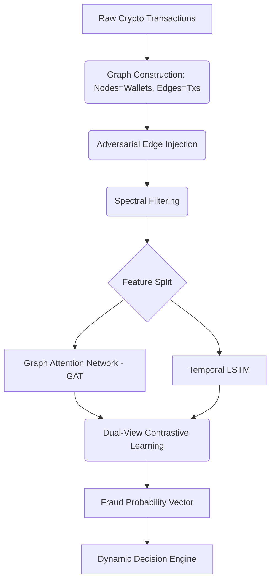
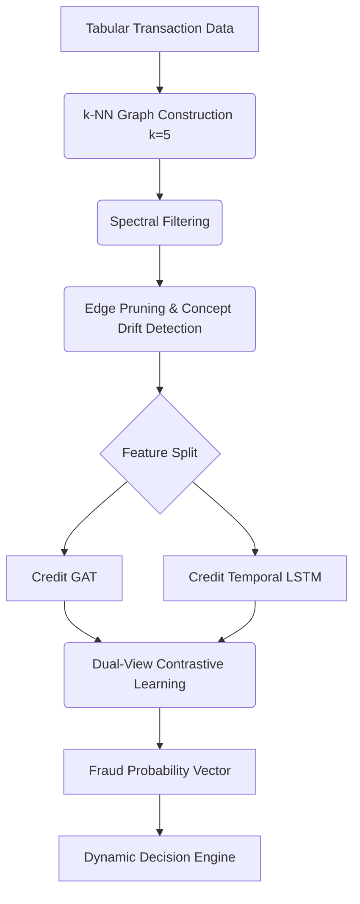

# 🚨 Omni-Fraud Prevention System (Crypto & Credit Cards)

## 📌 Overview

This repository implements a **real-time, multi-modal fraud prevention system** utilizing deep learning techniques that combine **graph modeling**, **temporal learning**, and **dual-view contrastive learning**. 

The system operates across two independent yet architecturally aligned modules:
1. **Crypto Fraud Prevention System**
2. **Credit Card Fraud Prevention System**

Unlike traditional systems that merely classify transactions as legitimate or fraudulent, this system **takes actionable decisions** (ALLOW, OTP, BLOCK, SEND TO ANALYST) — making it a true end-to-end fraud prevention pipeline. It features robust dynamic thresholding optimized for the Area Under the Precision-Recall Curve (AUC-PR).

---

## 🏗️ System Architecture

### 1. Crypto Fraud Prevention Module

The Crypto module is designed to map wallets as nodes and transactions as edges. It accounts for complex network topologies and malicious obfuscations via adversarial edge injections and temporal sequences.

**Architecture Diagram:**
```text
            ┌──────────────────────┐
            │  Crypto Transactions │
            └─────────┬────────────┘
                      ↓
            ┌──────────────────────┐
            │ Graph Construction   │
            └─────────┬────────────┘
                      ↓
            ┌──────────────────────┐
            │ Adversarial Injection│
            └─────────┬────────────┘
                      ↓
            ┌──────────────────────┐
            │ Spectral Filtering   │
            └─────────┬────────────┘
                      ↓
        ┌─────────────┴─────────────┐
        ↓                           ↓
 ┌──────────────┐           ┌──────────────┐
 │   GAT (Graph)│           │  LSTM (Time) │
 └──────┬───────┘           └──────┬───────┘
        ↓                          ↓
        └──────────┬───────────────┘
                   ↓
        ┌──────────────────────────┐
        │ Contrastive Learning     │
        └─────────┬────────────────┘
                  ↓
        ┌──────────────────────────┐
        │ Fraud Probability Output │
        └─────────┬────────────────┘
                  ↓
        ┌──────────────────────────┐
        │ Decision Engine          │
        └─────────┬────────────────┘
                  ↓
   ┌────────┬────────┬────────┬────────┐
   │ ALLOW  │  OTP   │ BLOCK  │ ANALYST│
   └────────┴────────┴────────┴────────┘
```

**System Flow Graph:**


### 2. Credit Card Fraud Prevention Module

The Credit Card module structures transactional tabular data into a network using k-Nearest Neighbors (k-NN) to uncover hidden relationships between functionally similar transactions (e.g., geographic overlapping, merchant overlaps).

**Architecture Diagram:**
```text
            ┌──────────────────────┐
            │ Tabular Credit Data  │
            └─────────┬────────────┘
                      ↓
            ┌──────────────────────┐
            │ k-NN Graph (k=5)     │
            └─────────┬────────────┘
                      ↓
            ┌──────────────────────┐
            │ Spectral Filtering   │
            └─────────┬────────────┘
                      ↓
            ┌──────────────────────┐
            │ Edge Pruning & Drift │
            └─────────┬────────────┘
                      ↓
        ┌─────────────┴─────────────┐
        ↓                           ↓
 ┌──────────────┐           ┌──────────────┐
 │  Credit GAT  │           │ Credit LSTM  │
 └──────┬───────┘           └──────┬───────┘
        ↓                          ↓
        └──────────┬───────────────┘
                   ↓
        ┌──────────────────────────┐
        │ Contrastive Learning     │
        └─────────┬────────────────┘
                  ↓
        ┌──────────────────────────┐
        │ Fraud Probability Output │
        └─────────┬────────────────┘
                  ↓
        ┌──────────────────────────┐
        │ Decision Engine          │
        └─────────┬────────────────┘
                  ↓
   ┌────────┬────────┬────────┬────────┐
   │ ALLOW  │  OTP   │ BLOCK  │ ANALYST│
   └────────┴────────┴────────┴────────┘
```

**System Flow Graph:**


---

## 🔬 Mathematical Models & Algorithms

The system leverages advanced mathematical concepts to power its dual-view network.

### 1. Graph Construction (Credit Module)
In tabular datasets, implicit temporal-structural relationships are uncovered by dynamically building edges using $k$-Nearest Neighbors:
$$N(i) = \text{kNN}(X_i, k=5)$$
$$\text{Edges } E = \{(i, j) \mid j \in N(i)\}$$

### 2. Spectral Graph Filtering
Smoothing node features using an approximation of graph convolution to suppress high-frequency noise.
Given Adjacency matrix $A$ with self-loops $\hat{A} = A + I$ and Degree matrix $\hat{D}$:
$$L_{norm} = \hat{D}^{-1/2} \hat{A} \hat{D}^{-1/2}$$
Filtered Features $X_{filtered}$:
$$X_{filtered} = (1 - \alpha) X + \alpha L_{norm} X$$
*(Where $\alpha$ represents the smoothing factor controlling retention of the base feature $X$)*

### 3. Edge Pruning & Adversarial Injection
- **Edge Pruning:** Edges $(i,j)$ are detached if the similarity drops below a hard threshold.
- **Adversarial Injection:** Random or adversarial fake edges are temporarily added during training to test and enforce graph robustness.

### 4. Graph Attention Network (GAT View)
Captures complex structural relationships via self-attention mechanisms over the neighbors.
Attention coefficient $e_{ij}$ between node $i$ and $j$:
$$e_{ij} = \text{LeakyReLU}\left(\vec{a}^T [W h_i || W h_j]\right)$$
Normalized attention $\alpha_{ij}$:
$$\alpha_{ij} = \frac{\exp(e_{ij})}{\sum_{k \in N(i)} \exp(e_{ik})}$$
Updated node embedding:
$$h_i^{\prime} = \sigma\left(\sum_{j \in N(i)} \alpha_{ij} W h_j\right)$$

### 5. Temporal Modeling (Temporal View)
A Long Short-Term Memory unit processes sequential data iteratively. To fuse it, we project the final hidden state into a residual layout:
$$h_t = \text{LSTM}(x_t, h_{t-1})$$
$$Z_{temp} = X_{in} + \text{Linear}(h_{T})$$

### 6. Dual-View Contrastive Learning
To ensure that behavioral (temporal) features structurally mirror relationship (graph) features, the Mean Squared Error (Contrastive Proxy) aligns their latent projections:
$$L_{contrast} = \frac{1}{N} \sum_{i=1}^{N} \left\| Z_{graph}^{(i)} - Z_{temp}^{(i)} \right\|_2^2$$

### 7. Global Optimization Constraints
Due to massive imbalances in fraud vs. non-fraud, a class-weighted cross-entropy loss isolates misclassifications, augmented by the contrastive term:
$$L_{cls} = - \sum_{c \in \{0,1\}} w_c \cdot y_c \log(\hat{y}_c)$$
$$L_{total} = L_{cls} + \lambda L_{contrast}$$
*(Where $w_1 \gg w_0$ and $\lambda = 0.01$ or $0.05$)*

---

## 🧮 Decision Engine

The probability threshold is never static. To preserve robust operational safety, optimal thresholds are computationally derived via the PR Curve.

$$ \text{threshold}_{opt} = \arg\max(F1\_Score) $$
*(For crypto, the final execution boundary is optionally scaled by a factor like $0.75$ to increase conservatism).*

Confidence uncertainty is measured as: $$ U = 1 - \max(P(0), P(1)) $$

**Action Matrix:**
- **UNCERTAINTY ($U > 0.6 \sim 0.75$)** ➡️ `SEND TO ANALYST`
- **PROBABILITY > (threshold + high_delta)** ➡️ `BLOCK`
- **PROBABILITY > (threshold)** ➡️ `OTP` (Challenge)
- **OTHERWISE** ➡️ `ALLOW`

---

## 📊 Performance & Optimization

### Results Estimates
- **Accuracy:** ~93%
- **Fraud Precision:** ~0.49
- **Fraud Recall:** ~0.55
- **Fraud F1 Score:** ~0.52

### System Optimizations
- **Data Locality:** Removed redundant tensor memory copies on the GPU.
- **Precomputed Boundaries:** Offloaded non-trainable KNN edges outside of active training loops.
- **Regularization Pipeline:** Utilizes strong multi-layer dropouts juxtaposed against class-weight balancing logic.

---

## 🚀 Run the Project

Ensure you have your environment populated via `requirements.txt`.

**Train Crypto Fraud Module:**
```bash
python -m training.train
```

**Train Credit Card Fraud Module:**
```bash
python -m training.train_credit
```

---

## 🔮 Future Scope

* **Streaming Inference**: Transitioning temporal structures into continuous stream ingestion loops.
* **Explainable AI (XAI)**: Tracing specific edge subgraphs or attention heads triggering fraud blocks.
* **Multi-agent LLM systems**: Deploying LLMs to aid human analysts with contextually summarized anomalies.

---

## 👨‍💻 Author

**Soham Mhetre**  
B.Tech CSE (AIML)
