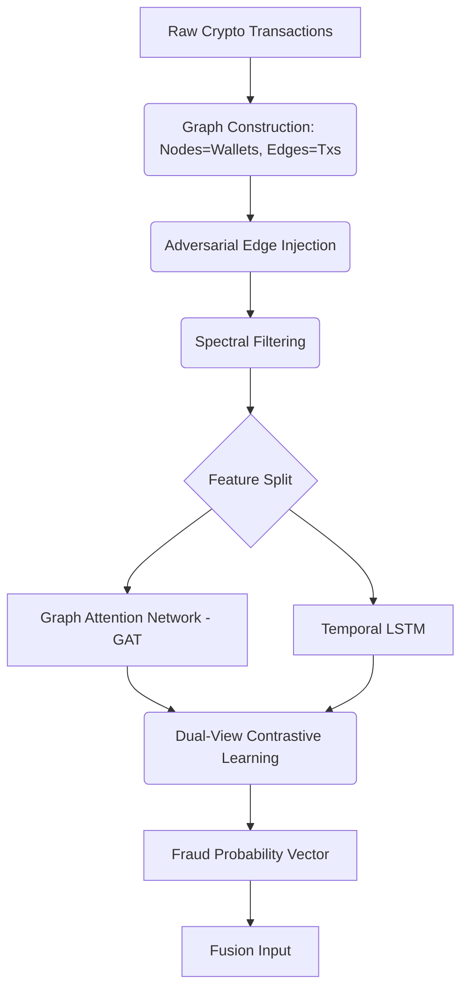
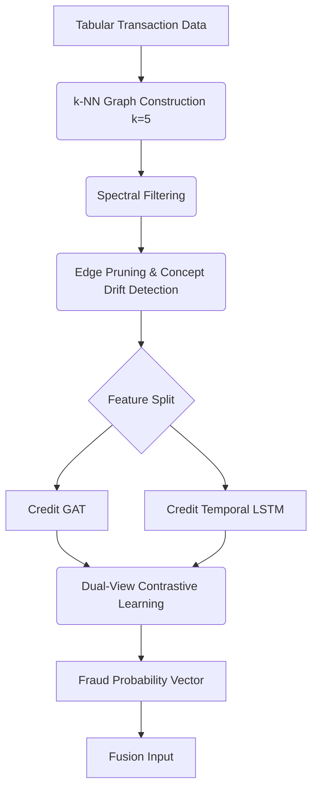

# 🚨 Omni-Fraud Prevention System (Crypto & Credit Cards)

## 📌 Overview

This repository implements a **real-time, multi-modal fraud prevention system** utilizing deep learning techniques that combine **graph modeling**, **temporal learning**, and **dual-view contrastive learning**. 

The system operates across two independent yet architecturally aligned modules, seamlessly integrated via a **Unified Fusion Engine**:
1. **Crypto Fraud Prevention System**
2. **Credit Card Fraud Prevention System**

Unlike traditional systems that merely classify transactions as legitimate or fraudulent, this system **takes actionable decisions** (ALLOW, OTP, BLOCK, SEND TO ANALYST) — making it a true end-to-end fraud prevention pipeline. It features an interactive UI dashboard and robust dynamic thresholding optimized for runtime adaptive percentile limits.

---

## 🏗️ System Architecture

### 1. Unified Fusion System
The integration architecture utilizes an intelligent confidence-based weighting engine that fuses independent probability vectors to establish dynamic bounds on inference outputs.

**Architecture Diagram:**
```text
          ┌────────────────┐       ┌────────────────┐
          │ Crypto Network │       │ Credit Network │
          └────────┬───────┘       └───────┬────────┘
                   │                       │
      (prob, uncert)       (prob, uncert)
                   │                       │
                   ▼                       ▼
          ┌─────────────────────────────────────────┐
          │         Unified Fusion Engine           │
          │  - Confidence Weighting & Scaling       │
          │  - Dual-Modal Probability Aggregation   │
          │  - Adaptive Percentile Thresholding     │
          └────────────────────┬────────────────────┘
                               │
                               ▼
          ┌─────────────────────────────────────────┐
          │            Decision Engine              │
          │   (ALLOW / OTP / BLOCK / ANALYST)       │
          └────────────────────┬────────────────────┘
                               │
                               ▼
          ┌─────────────────────────────────────────┐
          │      Streamlit Interactive Dashboard    │
          └─────────────────────────────────────────┘
```

### 2. Crypto Fraud Prevention Module

The Crypto module is designed to map wallets as nodes and transactions as edges. It accounts for complex network topologies and malicious obfuscations via adversarial edge injections and temporal sequences.

**System Flow Graph:**


### 3. Credit Card Fraud Prevention Module

The Credit Card module structures transactional tabular data into a network using k-Nearest Neighbors (k-NN) to uncover hidden relationships between functionally similar transactions (e.g., geographic overlapping, merchant overlaps).

**System Flow Graph:**


---

## 🔬 Mathematical Models & Algorithms

The system leverages advanced mathematical concepts to power its dual-view network and fusion pipeline.

### 1. Graph Construction (Credit Module)
In tabular datasets, implicit temporal-structural relationships are uncovered by dynamically building edges using $k$-Nearest Neighbors:
$$N(i) = \text{kNN}(X_i, k=5)$$
$$\text{Edges } E = \{(i, j) \mid j \in N(i)\}$$

### 2. Spectral Graph Filtering
Smoothing node features using an approximation of graph convolution to suppress high-frequency noise.
$$L_{norm} = \hat{D}^{-1/2} \hat{A} \hat{D}^{-1/2}$$
$$X_{filtered} = (1 - \alpha) X + \alpha L_{norm} X$$

### 3. Graph Attention Network (GAT View)
Captures complex structural relationships via self-attention mechanisms over the neighbors.
$$e_{ij} = \text{LeakyReLU}\left(\vec{a}^T [W h_i || W h_j]\right)$$
$$\alpha_{ij} = \frac{\exp(e_{ij})}{\sum_{k \in N(i)} \exp(e_{ik})}$$
$$h_i^{\prime} = \sigma\left(\sum_{j \in N(i)} \alpha_{ij} W h_j\right)$$

### 4. Dual-View Contrastive Learning
To ensure that behavioral (temporal) features structurally mirror relationship (graph) features, the Mean Squared Error aligns their latent projections:
$$L_{contrast} = \frac{1}{N} \sum_{i=1}^{N} \left\| Z_{graph}^{(i)} - Z_{temp}^{(i)} \right\|_2^2$$

### 5. Confidence-Weighted Fusion
Models output fraud probabilities $P_m$ and uncertainty limits $1 - P_m$. The fusion layer scales and maps inputs using uncertainty as the weight variable.
$$C_c = 1 - U_c, \quad C_k = 1 - U_k$$
$$W_c = \frac{C_c}{C_c + C_k + \epsilon}, \quad W_k = \frac{C_k}{C_c + C_k + \epsilon}$$
$$P_{final} = \sqrt{W_c P_c + W_k P_k}$$

### 6. Robust Dynamic Thresholding
Decision limits are bound organically from sample percentiles, establishing flexible operational minimums to adapt against drift:
$$\text{Block}_{threshold}  = \max(P_{90}, 0.4)$$
$$\text{Analyst}_{threshold} = \max(P_{70}, 0.2)$$

---

## 🧮 Decision Engine

The probability threshold is never static. Using the fusion percentiles computed during warm-up inference stages, decisions act dynamically across 4 severity tiers targeting both the final probability mapping and raw uncertainty profiles.

**Action Matrix:**
- **UNCERTAINTY ($U > 0.7$)** ➡️ `SEND TO ANALYST`
- **PROBABILITY $\ge$ Block Threshold** ➡️ `BLOCK`
- **PROBABILITY $\ge$ Analyst Threshold** ➡️ `OTP` (Challenge)
- **OTHERWISE** ➡️ `ALLOW`

---

## 📊 Performance & Optimization

### Results Estimates
- **Accuracy:** ~93%
- **Fraud Precision:** ~0.49
- **Fraud Recall:** ~0.55
- **Fraud F1 Score:** ~0.52

### System Optimizations
- **Data Locality:** Removed redundant tensor memory copies on the GPU.
- **Precomputed Boundaries:** Offloaded non-trainable KNN edges outside of active inference loops, caching large static components.
- **Regularization Pipeline:** Utilizes strong multi-layer dropouts juxtaposed against class-weight balancing logic and model temperature re-scaling.

---

## 🚀 Run the Project

Ensure you have your environment populated via `requirements.txt`.

**1. Train Crypto Fraud Module:**
```bash
python -m training.train
```

**2. Train Credit Card Fraud Module:**
```bash
python -m training.train_credit
```

**3. Launch Interactive Dashboard:**
```bash
streamlit run streamlit_app.py
```
*The Streamlit application will start the Unified Fusion component, initialize dynamic memory layers, and open a localized browser interface to visualize and filter predictive outcomes.*

---

## 🔮 Future Scope

* **Streaming Inference**: Transitioning temporal structures into continuous stream ingestion loops.
* **Explainable AI (XAI)**: Tracing specific edge subgraphs or attention heads triggering fraud blocks.
* **Multi-agent LLM systems**: Deploying LLMs to aid human analysts with contextually summarized anomalies.

---

## 👨‍💻 Author

**Soham Mhetre**  
B.Tech CSE (AIML)
